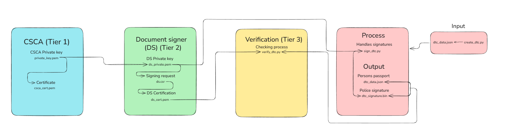

# Digital Travel Credential PKI Simulation

Projekti on simulaatio PKI-Infrastruktuurista (Public Key Infra) jota käytetään matkustusasiakirjoissa (DTC).
Toteutettu käyttämällä Linux-ympäristöä (WSL), Pythonia ja OpenSSL:ää.

## Projektin tarkoitus
Tavoitteena oli rakentaa, ymmärtää ja oppia "Chain of Trust" -malli, jota viranomaiset käyttävät passien myöntämiseen ja tarkistamiseen.

## Ominaisuudet
Vaiheet:

1. **PKI Hierarkian luonti (OpenSSL):**
   - **CSCA (Country Signing CA):** Juurisertifikaatin luonti.
   - **Document Signer (DS):** Allekirjoituspyynnön (CSR) luonti ja sertifikaatin myöntäminen CSCA-avaimella.

2. **DTC-tietorakenteen luonti (Python):**
   - `create_dtc.py`: Generoi JSON-muotoisen passidatan (sis. henkilötiedot ja Base64-koodatun kasvokuvan).

3. **Digitaalinen allekirjoitus:**
   - `sign_dtc.py`: Allekirjoittaa datan käyttäen Document Signerin yksityistä avainta (`ds_private.pem`).
   - Algoritmina käytetty `prime256v1` (ECDSA) ja SHA-256.

4. **Rajatarkastus-simulaatio:**
   - `verify_dtc.py`: Simuloi tarkastuslaitetta.
   - Verifioi datan eheyden (Integrity) ja alkuperän käyttäen DS-sertifikaattia (`ds_cert.pem`).
   - Tunnistaa automaattisesti, jos dataa on manipuloitu (MitM / väärennösyritys).

## Teknologiat
- **OS:** Linux (Ubuntu via WSL2)
- **Kielet:** Python 3
- **Kirjastot:** `cryptography`, `json`, `base64`
- **Työkalut:** OpenSSL

## How to Run
1. Asenna: `pip install cryptography`
2. Luo avaimet OpenSSL-komennoilla (vaihe osio).
3. Aja `python3 create_dtc.py` -> Luo passin.
4. Aja `python3 sign_dtc.py` -> Allekirjoittaa passin.
5. Aja `python3 verify_dtc.py` -> Tarkistaa allekirjoituksen.
